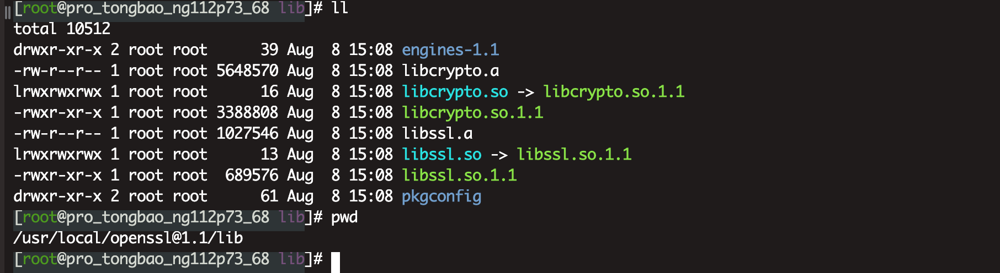
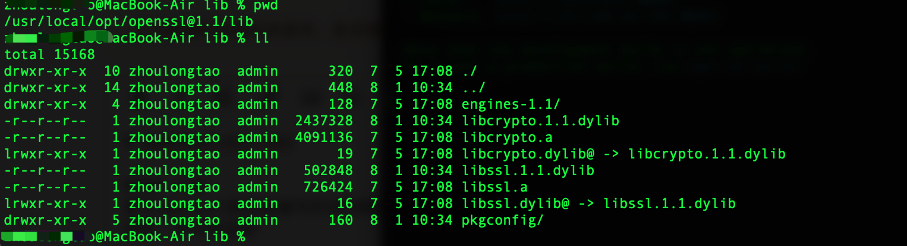
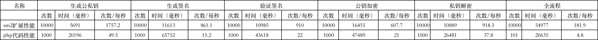

# openssl-ext-sm2

#### 介绍
基于openssl密码库编写的SM2椭圆曲线公钥密码算法PHP扩展

特性：非对称加密

git地址：https://gitee.com/state-secret-series/openssl-ext-sm2.git

#### 软件架构
zend 常规PHP扩展结构

#### 依赖要求

1，liunx :openssl/lib必须包含 libcrypto.so和libssl.so 动态库

2，mac :openssl/lib必须包含 libcrypto.dylib和libssl.dylib 动态库

例：liunx


例：mac


#### 安装教程

解压进入openssl-ext-sm2目录

```asm
cd openssl-ext-sm2-master
```
```asm
phpize
```
检查依赖
```asm
./configure  --with-openssl=/usr/local/openssl@1.1
```
检查结果
```asm
[lilunx openssl-ext-sm2]$ ./configure --with-openssl=/usr/local/openssl@1.1
checking for grep that handles long lines and -e... /usr/bin/grep
checking for egrep... /usr/bin/grep -E
checking for a sed that does not truncate output... /usr/bin/sed
checking for cc... cc
checking whether the C compiler works... yes
checking for C compiler default output file name... a.out
checking for suffix of executables...
checking whether we are cross compiling... no
checking for suffix of object files... o
checking whether we are using the GNU C compiler... yes
checking whether cc accepts -g... yes
checking for cc option to accept ISO C89... none needed
checking how to run the C preprocessor... cc -E
checking for icc... no
checking for suncc... no
checking whether cc understands -c and -o together... yes
checking for system library directory... lib
checking if compiler supports -R... no
checking if compiler supports -Wl,-rpath,... yes
checking build system type... x86_64-pc-linux-gnu
checking host system type... x86_64-pc-linux-gnu
checking target system type... x86_64-pc-linux-gnu
checking for PHP prefix... /usr/local/php
checking for PHP includes... -I/usr/local/php/include/php -I/usr/local/php/include/php/main -I/usr/local/php/include/php/TSRM -I/usr/local/php/include/php/Zend -I/usr/local/php/include/php/ext -I/usr/local/php/include/php/ext/date/lib
checking for PHP extension directory... /usr/local/php/lib/php/extensions/no-debug-non-zts-20180731
checking for PHP installed headers prefix... /usr/local/php/include/php
checking if debug is enabled... no
checking if zts is enabled... no
checking for re2c... no
configure: WARNING: You will need re2c 0.13.4 or later if you want to regenerate PHP parsers.
checking for gawk... gawk
checking for OpenSSL support... yes, shared
checking for Kerberos support... no
checking whether to use system default cipher list instead of hardcoded value... no
checking whether to enable sm2 support... yes, shared
checking for RAND_egd... no
checking for pkg-config... /usr/bin/pkg-config
checking for OpenSSL version... >= 1.0.1
checking for CRYPTO_free in -lcrypto... yes
checking for SSL_CTX_set_ssl_version in -lssl... yes
checking for ld used by cc... /usr/bin/ld
checking if the linker (/usr/bin/ld) is GNU ld... yes
checking for /usr/bin/ld option to reload object files... -r
checking for BSD-compatible nm... /usr/bin/nm -B
checking whether ln -s works... yes
checking how to recognize dependent libraries... pass_all
checking for ANSI C header files... yes
checking for sys/types.h... yes
checking for sys/stat.h... yes
checking for stdlib.h... yes
checking for string.h... yes
checking for memory.h... yes
checking for strings.h... yes
checking for inttypes.h... yes
checking for stdint.h... yes
checking for unistd.h... yes
checking dlfcn.h usability... yes
checking dlfcn.h presence... yes
checking for dlfcn.h... yes
checking the maximum length of command line arguments... 1572864
checking command to parse /usr/bin/nm -B output from cc object... ok
checking for objdir... .libs
checking for ar... ar
checking for ranlib... ranlib
checking for strip... strip
checking if cc supports -fno-rtti -fno-exceptions... no
checking for cc option to produce PIC... -fPIC
checking if cc PIC flag -fPIC works... yes
checking if cc static flag -static works... no
checking if cc supports -c -o file.o... yes
checking whether the cc linker (/usr/bin/ld -m elf_x86_64) supports shared libraries... yes
checking whether -lc should be explicitly linked in... no
checking dynamic linker characteristics... GNU/Linux ld.so
checking how to hardcode library paths into programs... immediate
checking whether stripping libraries is possible... yes
checking if libtool supports shared libraries... yes
checking whether to build shared libraries... yes
checking whether to build static libraries... no

creating libtool
appending configuration tag "CXX" to libtool
configure: creating ./config.status
config.status: creating config.h
config.status: config.h is unchanged
```
安装编译
```asm
make&&make install
```
修改php.ini
```asm
extension="sm2.so"
```

重启php-fpm或者apache


#### 使用说明

1.  创建公钥和私钥
```
$pub_key 取地址 结果为二进制
$pri_key 取地址 结果为二进制

sm2_key_pair($pub_key, $pri_key);

返回值int 0 成功 其他状态失败

```
2.  签名
```
$msg 信息
$signature 输出签名结果
$pri_key 私钥 二进制
$iv userid 没有设置默认为空的操作：如需为空请设置1234567812345678

sm2_sign($msg, $signature, $pri_key, $iv)


返回值int 0 成功 其他状态失败

```
3.  验签
```
$msg 信息
$signature 输入签名结果
$pub_key 公钥 二进制
$iv userid 没有设置默认为空的操作：如需为空请设置1234567812345678

sm2_sign_verify($msg, $signature, $pub_key, $iv)；

返回值int 0 成功 其他状态失败
```
4. 公钥加密
```
$msg 信息
$encrypt 输出加密结果 二进制 
$pub_key 公钥 二进制
sm2_encrypt($msg, $encrypt, $pub_key)

返回值int 0 成功 其他状态失败
```
5. 私钥解密
```
$encrypt 加密信息 二进制
$string 输出结果 明文
$pri_key 私钥
sm2_decrypt($encrypt, $string, $pri_key)

返回值int 0 成功 其他状态失败
```
6. 演示
```

 $msg = '这是测试';
 $iv = '1234567812345678'; //没有设置默认为空的操作：如需为空请设置1234567812345678

 sm2_key_pair($pub_key, $pri_key);
 base64_encode($pub_key);
 base64_encode($pri_key);
 #公钥:BHSAPGXtrHNxqJ3/b0+eNu2mdO0mpDfTGNJUMoEWpNpSL53Dw+YM/B/QT5OoLm4xQtw0hZY5wlWTR+cD629Grek=
 #私钥:++BuzKd1mPa0RXAJcY6DHDq9SUzo3T6/engbKReQRqI=

 sm2_sign($msg, $signature, $pri_key, $iv);
 base64_encode($signature);
 
 #私钥签名:+YHNtKkXbsRSs2nk5amd/YNqsiH8Kyr+oyLVVzuvRl+lqb40uzPxjsRo9QTYw7kZdWSfvM5lbxDMfF0cugQNfQ==

 sm2_sign_verify($msg, $signature, $pub_key, $iv);

 #公钥验签:0

 sm2_encrypt($msg, $encrypt, $pub_key);
 base64_encode($encrypt);
 
 #公钥加密:BBdm04Uh5EgzYKG3Ff8rBFJQZxRSXnrh9/WDZxS6PmzfnTDz0O0C115BPxMDfBNnOK5Ixs9kHTJPNSDoiHoiEmrnuotKN53rxnJtNd3MTbRjJOQ0sas9Kdktl1eHzj2/eseNaGh0LHZIOrBxAQ==
 sm2_decrypt($encrypt, $string, $pri_key);

 #私钥解密:这是测试

```

#### 性能测试
纯php代码实现国密算法：https://learnku.com/articles/68557

服务器参数
```
物理cpu：2个
逻辑cpu：8个
cpu核数：4个
运行内存：8G
```

使用php框架：lumen

参与加密数据
```asm
{"request":{"body":{"ntbusmody":[{"busmod":"00001"}],"ntdumaddx1":[{"bbknbr":"75","dyanam":"招商
测试","dyanbr":"11111111111","eftdat":"20220602","inbacc":"755936020410404","ovrctl":"N","yurref":"596620626253316098"}]},"head":{"funcode":"NTDUMADD","reqid":"202206021511010000001","userid":"B000001631"}},"signature":{"sigdat":"__signature_sigdat__","sigtim":"20220602161503"}}
```
userid
```asm
1234567812345678
```
性能分析
关于执行次数：1000/100次是因为使用纯php服务器跑不了10000次。


使用xhorf栈跟踪分析：

1,纯PHP代码性能图


2，PHP-sm2扩展代码性能图

