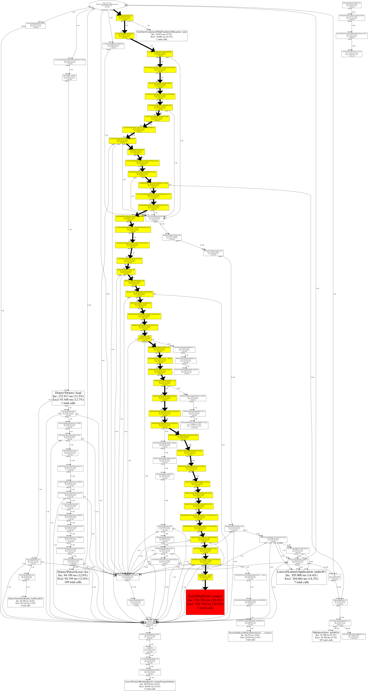

# openssl-ext-sm2

#### 介绍
基于openssl密码库编写的SM2椭圆曲线公钥密码算法PHP扩展

特性：非对称加密

原作者git地址：https://gitee.com/state-secret-series/openssl-ext-sm2.git

#### 软件架构
zend 常规PHP扩展结构

#### 依赖要求

1，liunx :openssl/lib必须包含 libcrypto.so和libssl.so 动态库

2，mac :openssl/lib必须包含 libcrypto.dylib和libssl.dylib 动态库

3，windows :openssl/lib必须包含 libcrypto.lib和libssl.lib 动态库

如出现：: undefined symbol: BN_CTX_secure_new 或其他类似的情况，就是没有动态库，openssl 不必升级以免影响正常的openssl扩展受影响，可在新目录安装openssl

教程：https://blog.csdn.net/qq_39316391/article/details/126363284

例：liunx


例：mac


#### 编译安装教程

Linux命令行环境编译示例
```asm
cd openssl-ext-sm2
phpize
./configure --with-openssl=/usr/local/openssl
make
make install
```

Windows命令行环境编译示例
相关所需资源可在如下网址去下载
https://github.com/php/php-sdk-binary-tools
https://windows.php.net/downloads/releases/archives
https://windows.php.net/downloads/php-sdk/deps
```asm
cd openssl-ext-sm2
set PHPDIR=E:\OpenSource\php
set PHPSDK=%PHPDIR%\php-sdk-binary-tools-php-sdk-2.3.0
set PHPDEPS=%PHPSDK%\deps
set PHPSRC=%PHPDIR%\php-7.2.18-devel-VC15-x64
set PATH=%PHPSRC%;%PATH%
call %PHPSDK%\phpsdk-vc15-x64
phpize
configure --with-extra-includes="%PHPDEPS%\openssl-1.1.1s-74-vc15-x64\include" --with-extra-libs="%PHPDEPS%\openssl-1.1.1s-74-vc15-x64\lib" --enable-sm2 --with-prefix=%PHPDIR%\install
nmake
nmake install
```

#### 使用说明

1.  创建公钥和私钥
```
$pub_key 取地址 结果为二进制
$pri_key 取地址 结果为二进制

sm2_key_pair($pub_key, $pri_key);

返回值int 0 成功 其他状态失败

```
2.  签名
```
$msg 信息
$signature 输出签名结果 注意签名结果的左边32字节与右边32字节也被叫做签名R值与签名S值
$pri_key 私钥 二进制
$iv userid 没有设置默认为空的操作：如需为空请设置1234567812345678
$mode 没有设置默认为0标准模式,可选 0=标准模式 2=某些银行Java变种模式

sm2_sign($msg, $signature, $pri_key, $iv, $mode)


返回值int 0 成功 其他状态失败

```
3.  验签
```
$msg 信息
$signature 输入签名结果 注意签名结果的左边32字节与右边32字节也被叫做签名R值与签名S值
$pub_key 公钥 二进制
$iv userid 没有设置默认为空的操作：如需为空请设置1234567812345678
$mode 没有设置默认为0标准模式,可选 0=标准模式 2=某些银行Java变种模式

sm2_sign_verify($msg, $signature, $pub_key, $iv, $mode)；

返回值int 0 成功 其他状态失败
```
4. 公钥加密
```
$msg 信息
$encrypt 输出加密结果 二进制 
$pub_key 公钥 二进制
$mode 没有设置默认为0新标准模式,可选 0=新标准/C1C3C2模式 1=旧标准/C1C2C3模式 2=某些银行Java旧标准变种模式

sm2_encrypt($msg, $encrypt, $pub_key, $mode)

返回值int 0 成功 其他状态失败
```
5. 私钥解密
```
$encrypt 加密信息 二进制
$string 输出结果 明文
$pri_key 私钥
$mode 没有设置默认为0新标准模式,可选 0=新标准/C1C3C2模式 1=旧标准/C1C2C3模式 2=某些银行Java旧标准变种模式

sm2_decrypt($encrypt, $string, $pri_key, $mode)

返回值int 0 成功 其他状态失败
```
6. 演示
```

 $msg = '这是测试';
 $iv = '1234567812345678'; //没有设置默认为空的操作：如需为空请设置1234567812345678

 sm2_key_pair($pub_key, $pri_key);
 base64_encode($pub_key);
 base64_encode($pri_key);
 #公钥:BHSAPGXtrHNxqJ3/b0+eNu2mdO0mpDfTGNJUMoEWpNpSL53Dw+YM/B/QT5OoLm4xQtw0hZY5wlWTR+cD629Grek=
 #私钥:++BuzKd1mPa0RXAJcY6DHDq9SUzo3T6/engbKReQRqI=

 sm2_sign($msg, $signature, $pri_key, $iv);
 base64_encode($signature);
 
 #私钥签名:+YHNtKkXbsRSs2nk5amd/YNqsiH8Kyr+oyLVVzuvRl+lqb40uzPxjsRo9QTYw7kZdWSfvM5lbxDMfF0cugQNfQ==

 sm2_sign_verify($msg, $signature, $pub_key, $iv);

 #公钥验签:0

 sm2_encrypt($msg, $encrypt, $pub_key);
 base64_encode($encrypt);
 
 #公钥加密:BBdm04Uh5EgzYKG3Ff8rBFJQZxRSXnrh9/WDZxS6PmzfnTDz0O0C115BPxMDfBNnOK5Ixs9kHTJPNSDoiHoiEmrnuotKN53rxnJtNd3MTbRjJOQ0sas9Kdktl1eHzj2/eseNaGh0LHZIOrBxAQ==
 sm2_decrypt($encrypt, $string, $pri_key);

 #私钥解密:这是测试

```

#### 性能测试
纯php代码实现国密算法：https://learnku.com/articles/68557
注意事项：此sm2扩展加密结果额外增加了04开头,如两方加解密不互通请查看此处
```asm
04c30f5ef97396dc63273cb4fc70a3a0695ad8041b8019d1f0e74236d4d014842a6f1c5318ce0aaa33d360252640b850cd6a59e4cf33477076d79948e90cf664227675aa024a904fecdffc2b5ade4af0a02365e0812c0359ae38ede53d72ebd5e7b95c2560bcb7
```

服务器参数
```
物理cpu：2个
逻辑cpu：8个
cpu核数：4个
运行内存：8G
```

使用php框架：lumen

参与加密数据
```asm
{"request":{"body":{"ntbusmody":[{"busmod":"00001"}],"ntdumaddx1":[{"bbknbr":"75","dyanam":"招商
测试","dyanbr":"11111111111","eftdat":"20220602","inbacc":"755936020410404","ovrctl":"N","yurref":"596620626253316098"}]},"head":{"funcode":"NTDUMADD","reqid":"202206021511010000001","userid":"B000001631"}},"signature":{"sigdat":"__signature_sigdat__","sigtim":"20220602161503"}}
```
userid
```asm
1234567812345678
```
性能分析

关于执行次数：1000/100次是因为使用纯php服务器跑不了10000次。


使用xhorf栈跟踪分析：

1,纯PHP代码性能图


2，PHP-sm2扩展代码性能图

